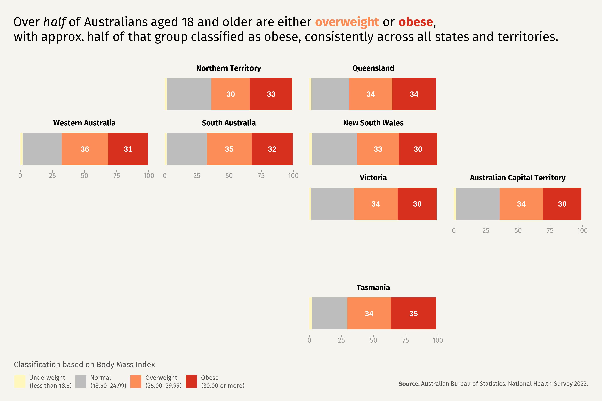

Inspired by the plot created with geofacet at[ https://r-graph-gallery.com/web-time-series-and-facetting.html](https://r-graph-gallery.com/web-time-series-and-facetting.html), which was guided by Tomi Capretto, the following plot shows percentages of overweight and obese Australians. This stacked bar chart displays the relevant percentages and is faceted by states and territories, arranged to mimic their geographical locations.

Link to data: <https://www.abs.gov.au/statistics/health/health-conditions-and-risks/national-health-survey/2022/NHSDC02.xlsx>
